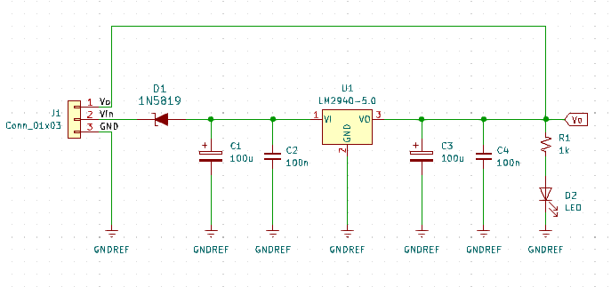
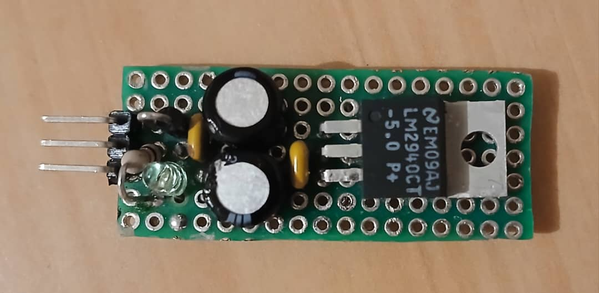
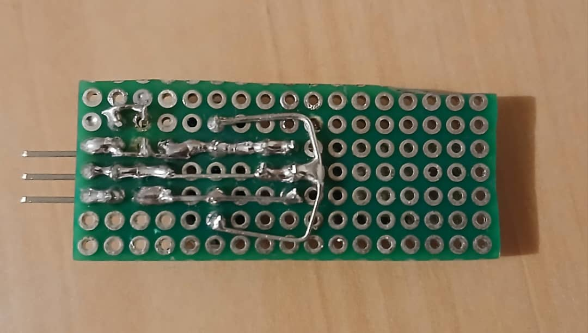
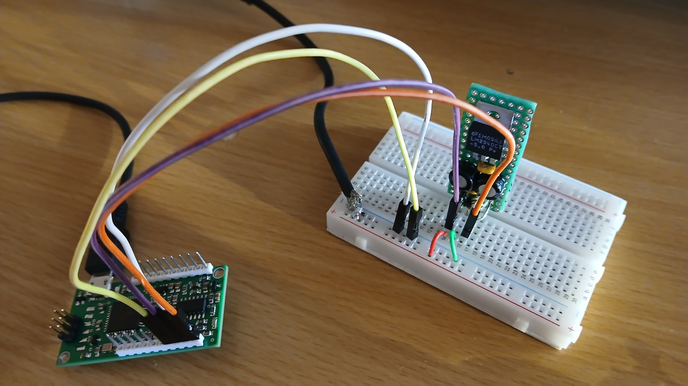
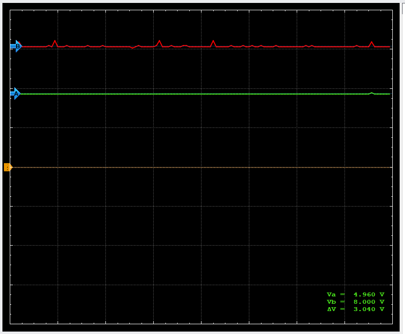
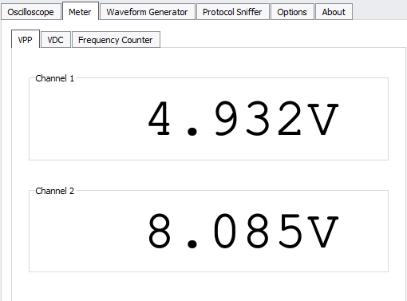
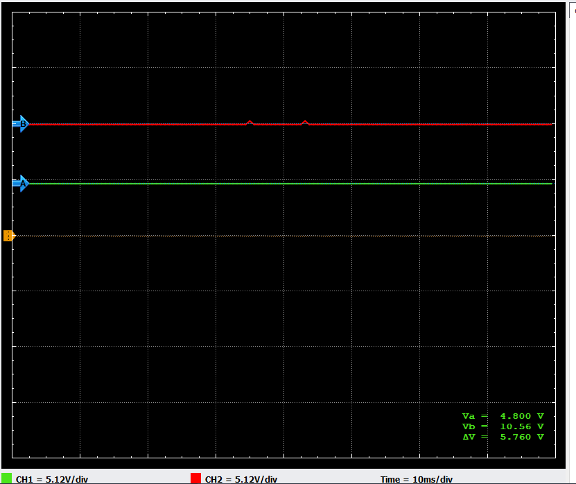
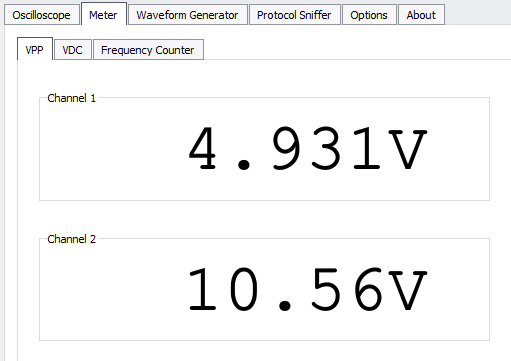
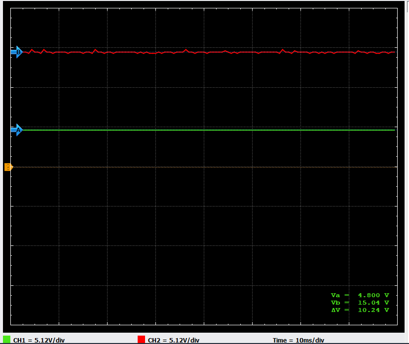
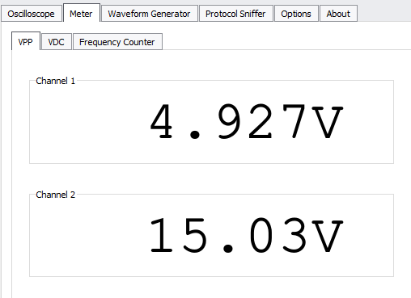

# Regulador-de-Voltaje-Lineal-5V
Diseño e implementación de un circuito regulador de 5V utilizando el regulador lineal LM2940.

- Voltaje de entrada: 7-35V DC

- Voltaje de salida regulado: 5V DC

## 🛠️ Componentes

- Regulador LM2940
- Diodo Schottky 1N5819
- Resistencia de 1K
- 2 capacitores electrolíticos de 100uF
- 2 capacitores cerámicos de 100nF
- LED
- Conector de 3 pines
- Placa PCB de prototipo (baquelita perforada)

## 📐 Esquemático

## 📸 PCB (Tarjeta Prototipo)

### Top Layer

### Bottom Layer

### 📊 Pruebas

Pruebas con diferentes voltajes de entrada usando [Mini Osciloscopio](https://github.com/Giancarlo0811/Mini-Osciloscopio).

- Channel 1 (cable naranja): Voltaje regulado 
- Channel 2 (cable morado): Voltaje de entrada

- #### Voltaje de entrada 8V DC (🎬 [Video](https://youtu.be/low_0nrt3PA))

- CH1 (verde)
- CH2 (rojo)

- #### Voltaje de entrada 10V DC

- CH1 (verde)
- CH2 (rojo)

- #### Voltaje de entrada 15V DC

- CH1 (verde)
- CH2 (rojo)

