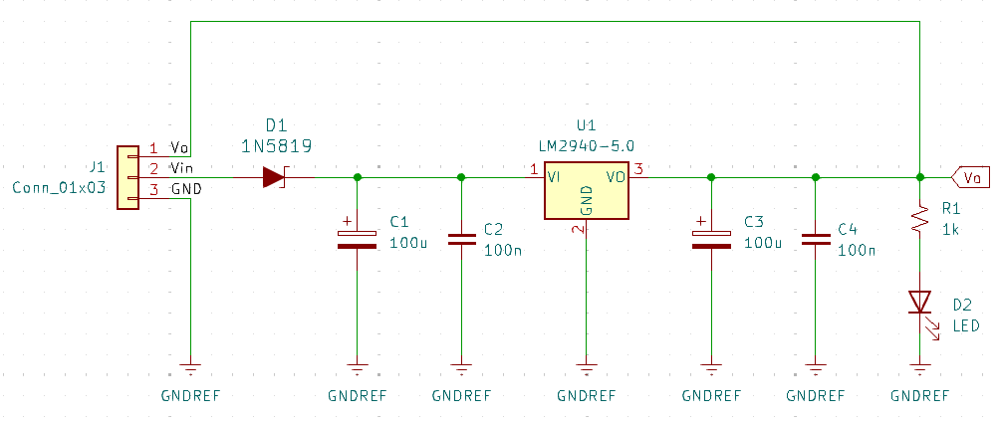

# Regulador-de-Voltaje-Lineal-5V
Circuito regulador de voltaje de 5V con el regulador lineal LM2940.

## Componentes

- Regulador LM2940
- Diodo Schottky 1N5819
- Resistencia de 1K
- 2 capacitores electrolíticos de 100uF
- 2 capacitores cerámicos de 100nF
- LED
- Conector de 3 pines

## Esquemático

## PCB
